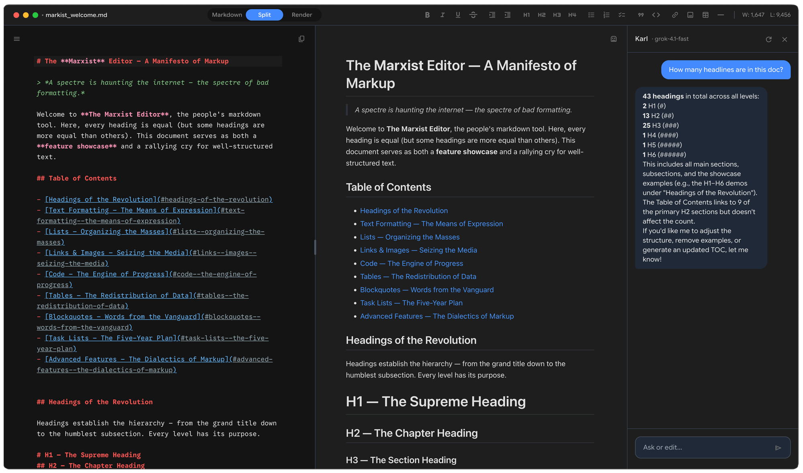
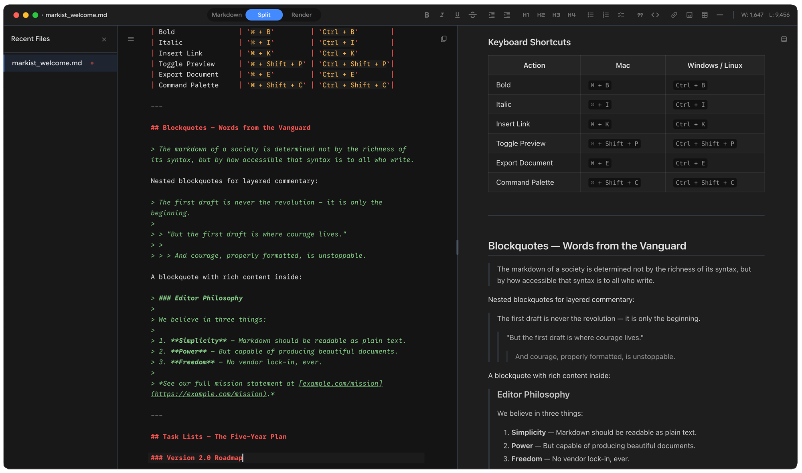

<p align="center">
  
</p>

<h1 align="center">Marxist</h1>

<p align="center">
  <strong>A markdown editor for the AI age</strong>
</p>

<p align="center">
  <a href="#features">Features</a> •
  <a href="#screenshots">Screenshots</a> •
  <a href="#installation">Installation</a> •
  <a href="#keyboard-shortcuts">Shortcuts</a> •
  <a href="#ai-integration">AI Integration</a> •
  <a href="#development">Development</a>
</p>

---

Marxist is a focused, elegant Markdown editor for macOS. It's not trying to be Notion, Obsidian, or a second brain. It's a **writing tool** — designed for people who want to write and preview Markdown with zero friction, a beautiful UI, and optional AI assistance that can directly edit your document.

## Features

- **Three Views** — Switch seamlessly between Markdown-only, Split (editor + preview), and Render-only views
- **AI-Powered Editing** — An AI assistant that doesn't just suggest — it can directly edit your document with diff highlighting
- **Beautiful Syntax Highlighting** — Color-coded Markdown tokens for maximum readability
- **GitHub Flavored Markdown** — Full GFM support including tables, task lists, strikethrough, and code block highlighting
- **Math Support** — LaTeX math rendering via KaTeX
- **Dark & Light Modes** — Both themes fully designed, respects system preference
- **Tab System** — Open multiple files with instant switching and session restore
- **No Lock-in** — Files are just `.md` files on disk. No proprietary format, no database, no sync service
- **Manual Save** — You're in control. Unsaved drafts are preserved automatically for crash safety

## Screenshots

<p align="center">
  
</p>

<p align="center">
  <em>Split view with syntax-highlighted editor, live preview, and AI assistant panel</em>
</p>

<p align="center">
  
</p>

<p align="center">
  <em>File sidebar for recent documents and keyboard shortcuts reference</em>
</p>

## Installation

### Download

Download the latest release from the [Releases](https://github.com/IIWIO/marxist/releases) page.

- **Apple Silicon (M1/M2/M3):** `Marxist-x.x.x-arm64.dmg`
- **Intel Mac:** `Marxist-x.x.x.dmg`

### Build from Source

```bash
# Clone the repository
git clone https://github.com/IIWIO/marxist.git
cd marxist

# Install dependencies
npm install

# Run in development mode
npm run dev

# Build for macOS
npm run build:mac
```

## Keyboard Shortcuts

| Action | Shortcut |
|--------|----------|
| New File | `⌘ N` |
| Open File | `⌘ O` |
| Save | `⌘ S` |
| Save As | `⌘ ⇧ S` |
| Find & Replace | `⌘ F` |
| Markdown View | `⌘ 1` |
| Split View | `⌘ 2` |
| Render View | `⌘ 3` |
| Toggle Sidebar | `⌘ \` |
| Toggle AI Panel | `⌘ ⇧ A` |
| Copy Raw Markdown | `⌘ ⇧ C` |
| Bold | `⌘ B` |
| Italic | `⌘ I` |
| Inline Code | `⌘ E` |
| Toggle Dark/Light | `⌘ ⇧ D` |
| Settings | `⌘ ,` |

## AI Integration

Marxist integrates with [OpenRouter](https://openrouter.ai) to provide AI-powered writing assistance. The AI can:

- **Chat** — Ask questions about your document, get suggestions, brainstorm ideas
- **Direct Editing** — Ask the AI to make changes and it will modify your document directly with diff highlighting
- **Accept or Revert** — Review AI changes with added/removed line highlighting before accepting

### Setup

1. Get an API key from [OpenRouter](https://openrouter.ai)
2. Open Settings (`⌘ ,`)
3. Paste your API key in the AI Configuration section
4. Choose your preferred model from the dropdown

Your API key is stored securely and all API calls are made from the main process — never exposed to the renderer.

## Markdown Support

Marxist supports **GitHub Flavored Markdown 2.0** with additional extensions:

- Tables
- Task lists / Checkboxes
- Strikethrough
- Autolinks
- Syntax-highlighted code blocks (100+ languages)
- Math expressions (KaTeX)
- YAML frontmatter

## Tech Stack

| Layer | Technology |
|-------|------------|
| Framework | Electron |
| Frontend | React 18 |
| State Management | Zustand |
| Editor | CodeMirror 6 |
| Markdown | unified / remark / rehype |
| Styling | Tailwind CSS |
| Build | electron-vite |
| Packaging | electron-builder |

## Development

### Prerequisites

- Node.js 18+
- npm 9+
- macOS (for building the macOS app)

### Scripts

```bash
# Development with hot reload
npm run dev

# Build for production
npm run build

# Build macOS app
npm run build:mac

# Run tests
npm test

# Lint code
npm run lint

# Type check
npm run typecheck
```

### Project Structure

```
marxist/
├── src/
│   ├── main/           # Electron main process
│   ├── preload/        # Preload scripts (IPC bridge)
│   ├── renderer/       # React app entry
│   ├── components/     # React components
│   ├── stores/         # Zustand stores
│   ├── hooks/          # Custom React hooks
│   └── styles/         # CSS and themes
├── assets/             # Icons, fonts, screenshots
└── electron-builder.yml
```

## Philosophy

1. **Simplicity first** — Three views, one purpose: write Markdown well
2. **Beautiful defaults** — Looks great out of the box
3. **AI as an editor, not just a chatbot** — The AI can read and rewrite the document in real-time
4. **No lock-in** — Plain `.md` files, no proprietary format
5. **Manual save** — The user is in control

## License

MIT License — see [LICENSE](LICENSE) for details.

---

<p align="center">
  Made with ☕ by <a href="https://github.com/IIWIO">IIWIO</a>
</p>
